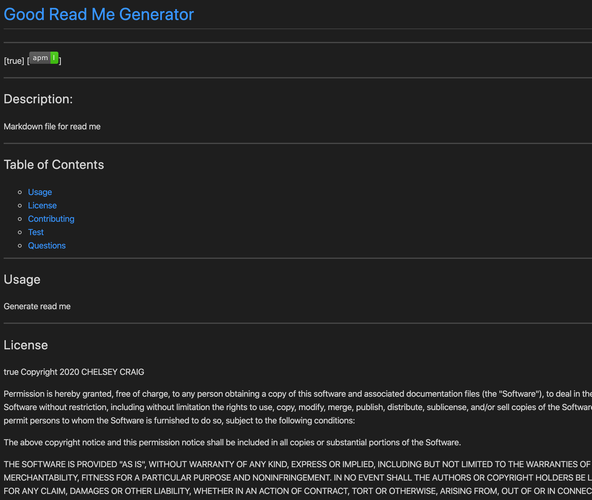
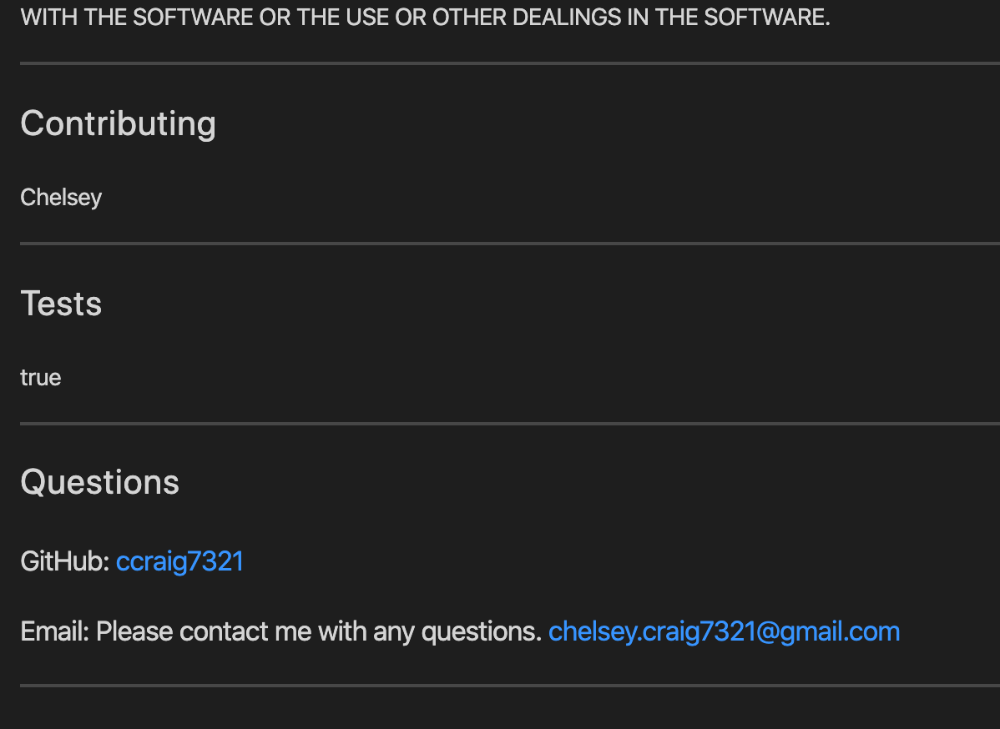

# ReadMe-Generator
___

## Description

The goal of this assignment was for me to use node.JS to create a command line application that generated a markdown file for a README.

___

## Table of Contents

    * [Usage](#usage)
    * [License](#license)
    * [Contributing](#contributing)
    * [Test](#test)
    * [Questions](#questions)
___

## How it Works

Completing this assignment involved obtaining a deeper understanding of node.JS. Writing this application combined the use of backend JavaScript with command line to create a series of prompts for the user to fill in. This first began by installing the npm inquirer module by typing in "npm install" into the command line, thus producing both a package.json and a package-lock.json file. From there, I added two constants: const inquirer = require("inquirer") and fs = require('fs') in order to access the node modules as well as the fs node package that is in JavaScript. I then wrote code for the inquirer.prompt array that had the user give input or answer yes/no prompts to gather the users specific data.  This was used in the .then function to console log the user's answers.

After the user's answers are console logged, I then used the writeFile function to get the user information to appear on the page.  The data for this function was then written using template literals formatted to produce the correct sizes headers, line breaks, and badges needed based on the users answers. Personal links to the users GitHub and email addresses were also created to add to the user's experience. Also, I made the table of contents in such a way that the user can click on each list item and be taken directly to the section of the page to view that item's content. Below are images of the finished product.

___

___

## Link to Video of Project

https://drive.google.com/file/d/1HBhvoNmwH8bjLVGSX0K7DSihHrdTyUDF/view

___

## License

 Copyright 2020 CHELSEY CRAIG

Permission is hereby granted, free of charge, to any person obtaining a copy of this software and associated documentation files (the "Software"), to deal in the Software without restriction, including without limitation the rights to use, copy, modify, merge, publish, distribute, sublicense, and/or sell copies of the Software, and to permit persons to whom the Software is furnished to do so, subject to the following conditions:

The above copyright notice and this permission notice shall be included in all copies or substantial portions of the Software.

THE SOFTWARE IS PROVIDED "AS IS", WITHOUT WARRANTY OF ANY KIND, EXPRESS OR IMPLIED, INCLUDING BUT NOT LIMITED TO THE WARRANTIES OF MERCHANTABILITY, FITNESS FOR A PARTICULAR PURPOSE AND NONINFRINGEMENT. IN NO EVENT SHALL THE AUTHORS OR COPYRIGHT HOLDERS BE LIABLE FOR ANY CLAIM, DAMAGES OR OTHER LIABILITY, WHETHER IN AN ACTION OF CONTRACT, TORT OR OTHERWISE, ARISING FROM, OUT OF OR IN CONNECTION WITH THE SOFTWARE OR THE USE OR OTHER DEALINGS IN THE SOFTWARE.

